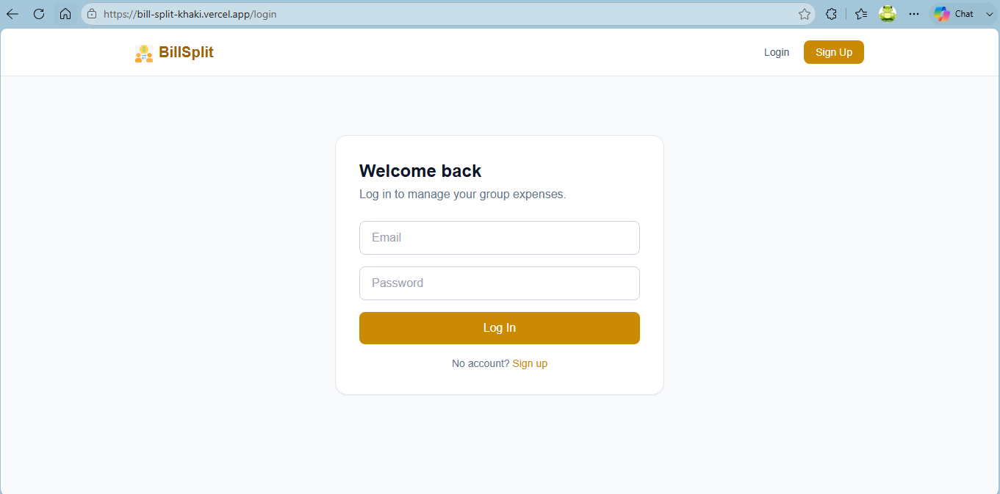
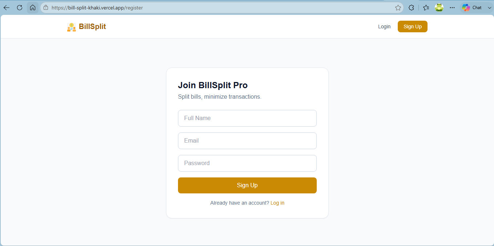
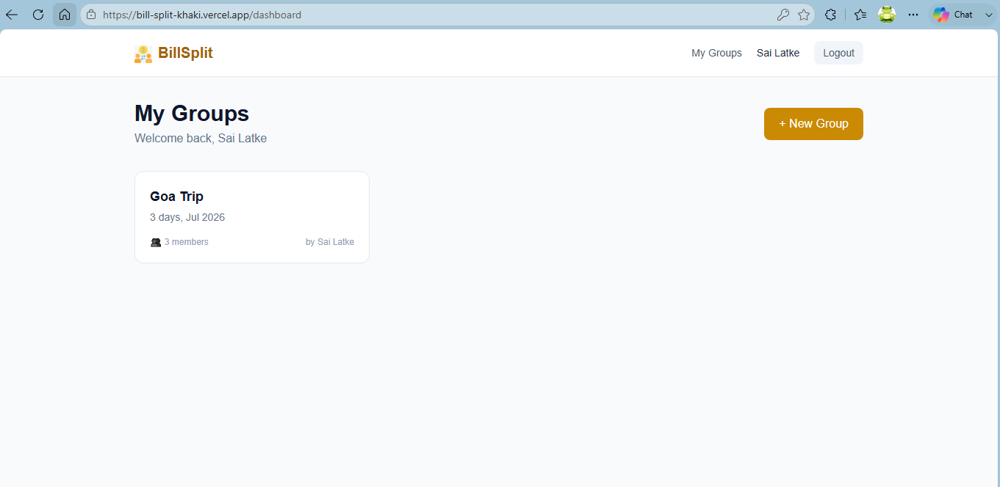
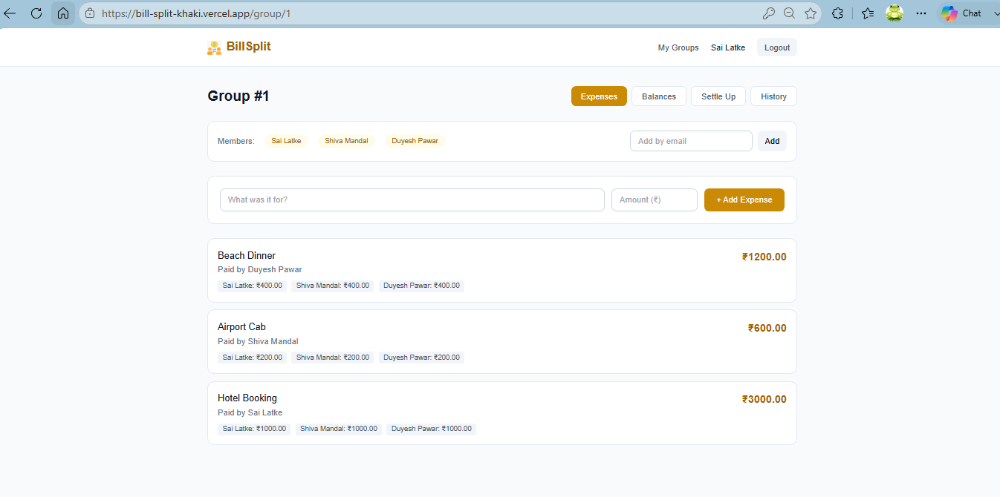
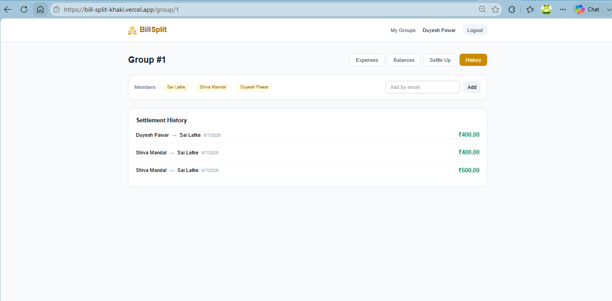
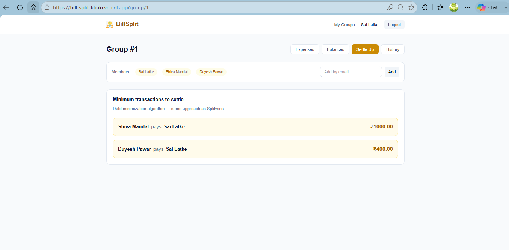
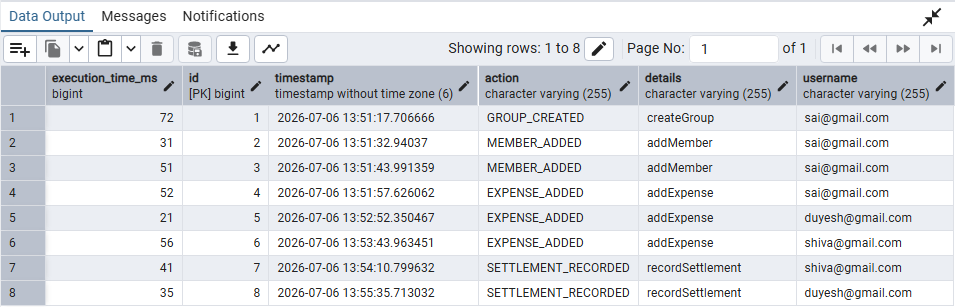
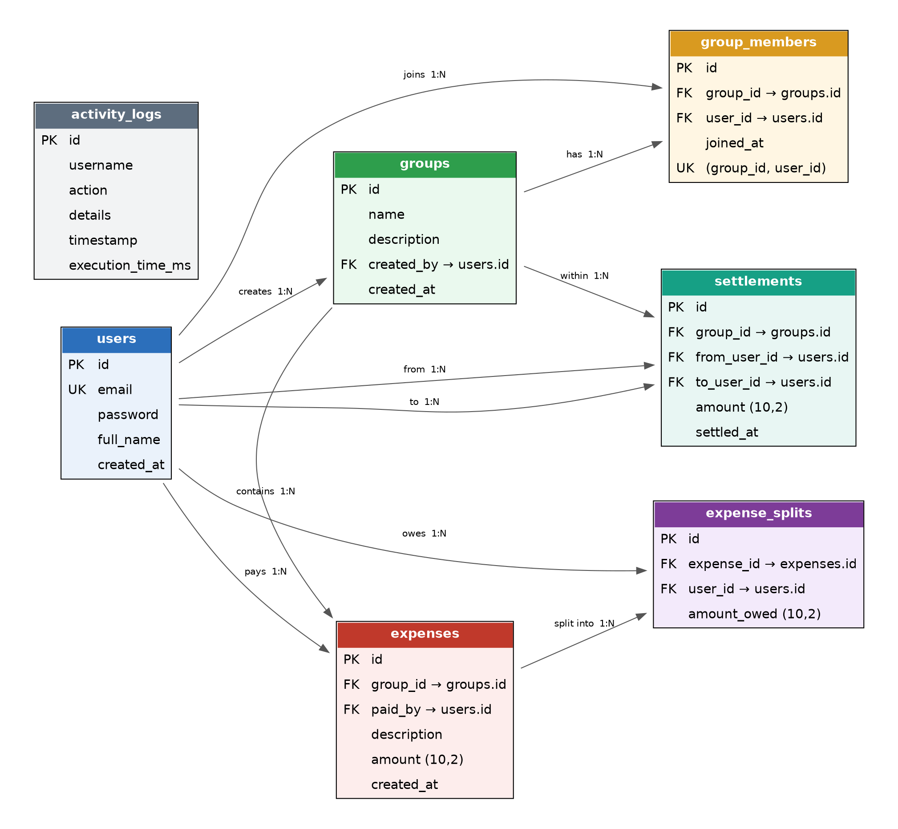

# 🧾 BillSplit – Smart Group Expense Splitter

<p align="center">


</p>

A full-stack expense sharing platform inspired by **Splitwise** that intelligently minimizes settlement transactions between group members.

> _"Track shared expenses, calculate everyone's fair share, and settle debts with the minimum number of payments."_

Built using **Spring Boot**, **React**, **PostgreSQL**, **Spring Security**, **JWT Authentication**, **Spring AOP**, and **Spring Scheduling**, the application demonstrates clean architecture, secure authentication, financial calculations, and algorithmic problem solving.

---

# 🌐 Live Demo

**Frontend:** https://bill-split-khaki.vercel.app

**Backend API:** https://billsplit-1-3kpi.onrender.com

**Database:** Neon PostgreSQL

---

# 📸 Application Preview

## Login



---

## Register



---

## Dashboard



---

## Add Expense



---

## Expense History



---

## Settlement Suggestions



---

## Activity Logs



---

## Database Schema



---

# ✨ Features

## 🔐 Authentication

- User Registration
- Secure Login
- JWT Authentication
- BCrypt Password Encryption
- Protected REST APIs
- Stateless Authentication
- Role-ready architecture

---

## 👥 Group Management

Users can

- Create groups
- Invite members
- Join multiple groups
- View group members
- Manage group expenses

---

## 💰 Expense Management

Users can

- Add expenses
- Specify payer
- Split equally among members
- View complete expense history
- Track spending per group

---

## 📊 Net Balance Calculation

Instead of manually calculating dozens of transactions, BillSplit Pro computes each member's **net balance**.

Example

Total Expense = ₹10

```
T1 Paid ₹5
T2 Paid ₹2
T3 Paid ₹3
T4 Paid ₹0
T5 Paid ₹0
```

Each member should contribute ₹2.

Net Balance

```
T1 +3
T2  0
T3 +1
T4 -2
T5 -2
```

Positive balance → should receive money

Negative balance → owes money

---

## 🔄 Debt Minimization Algorithm

The core feature of BillSplit Pro.

Instead of generating many confusing transactions, the application reduces settlements to the **minimum number of payments**.

Example

```
T4 → T1 ₹2

T5 → T1 ₹1

T5 → T3 ₹1
```

Only **three transactions** settle the entire group.

This approach is inspired by the debt simplification strategy used in **Splitwise**.

---

## 📈 Dashboard

The dashboard provides

- Total Groups
- Total Expenses
- Amount You Owe
- Amount Others Owe You
- Recent Expenses
- Pending Settlements

---

## ⚡ Spring AOP Features

BillSplit Pro uses Spring AOP for real production-style features.

### @LogActivity

Automatically

- Logs expense creation
- Logs settlement records
- Measures execution time
- Maintains an audit trail

without polluting business services with logging code.

---

## ⏰ Spring Scheduler

A scheduled background job runs every morning.

It automatically

- Finds unsettled debts older than seven days
- Logs reminder events
- Keeps track of pending settlements

using Spring's `@Scheduled` annotation.
---

# 🏗 Architecture

```
                         React Frontend
                                │
                        Axios REST Calls
                                │
                     Spring Boot REST API
                                │
                  Spring Security + JWT Filter
                                │
                     Controllers → Services
                                │
        ┌───────────────────────┼────────────────────────┐
        │                       │                        │
   Settlement Engine      Spring AOP             Spring Scheduler
(Debt Minimization)    Activity Logging       Daily Debt Reminder
        │
        │
  Spring Data JPA
        │
 PostgreSQL Database
```

The architecture follows a layered design where the frontend communicates with secure REST APIs. Business logic remains inside the service layer while cross-cutting concerns such as logging are handled using Spring AOP.

---

# 🧠 Debt Minimization Algorithm

Instead of tracking every individual payment, BillSplit Pro calculates the **net balance** of each member.

### Step 1 – Calculate Net Balance

```
Net Balance = Amount Paid − Fair Share
```

Example

```
Total Expense = ₹10

Members = 5

Each should pay ₹2

---------------------------------

T1 Paid ₹5 → +₹3

T2 Paid ₹2 → ₹0

T3 Paid ₹3 → +₹1

T4 Paid ₹0 → -₹2

T5 Paid ₹0 → -₹2
```

Positive balance

```
Person should receive money.
```

Negative balance

```
Person owes money.
```

---

### Step 2 – Match Creditors and Debtors

Largest Creditor

```
T1 +3
```

Largest Debtor

```
T4 -2
```

Settlement

```
T4 → T1 ₹2
```

Updated Balance

```
T1 +1

T4 0
```

Next

```
T5 → T1 ₹1

T5 → T3 ₹1
```

Everyone becomes

```
Balance = 0
```

The algorithm continues until every member's balance reaches zero.

This greedy strategy minimizes the number of settlement transactions and is inspired by applications like **Splitwise**.

---

# 🔐 Authentication Flow

```
User

↓

Register / Login

↓

JWT Generated

↓

Token Stored in Browser

↓

Every Request

↓

Authorization Header

↓

JWT Filter

↓

Spring Security

↓

Protected REST APIs
```

Only authenticated users can create groups, add expenses, or settle debts.

---

# 💸 Expense Flow

```
Create Group

↓

Add Members

↓

Add Expense

↓

Calculate Net Balance

↓

Debt Minimization

↓

Settlement Suggestions

↓

Record Payment

↓

Balances Updated
```

This workflow allows groups to continuously add expenses while maintaining up-to-date settlement suggestions.

---

# 📁 Project Structure

```
billsplit-pro/

│

├── backend/

│   ├── controller/

│   ├── service/

│   ├── repository/

│   ├── entity/

│   ├── dto/

│   ├── security/

│   ├── config/

│   ├── scheduler/

│   ├── aop/

│   └── exception/

│

├── frontend/

│   ├── api/

│   ├── components/

│   ├── context/

│   ├── pages/

│   ├── assets/

│   └── styles/

│

└── README.md
```

---

# 🛠 Tech Stack

## Frontend

- React
- Vite
- JavaScript
- Tailwind CSS
- Axios
- React Router
- Recharts

---

## Backend

- Java 21
- Spring Boot 3
- Spring Security
- JWT Authentication
- Spring Data JPA
- Spring AOP
- Spring Scheduling
- Maven
- REST APIs

---

## Database

- PostgreSQL (Neon)

---

## Deployment

| Service | Platform |
|----------|----------|
| Frontend | Vercel |
| Backend | Render |
| Database | Neon PostgreSQL |

---

# 📡 REST API Overview

| Method | Endpoint | Description |
|---------|-------------------------------|------------------------------|
| POST | /api/auth/register | Register user |
| POST | /api/auth/login | Login |
| POST | /api/groups | Create group |
| GET | /api/groups | My groups |
| POST | /api/groups/{id}/members | Add member |
| POST | /api/expenses | Add expense |
| GET | /api/expenses/group/{id} | Expense history |
| GET | /api/groups/{id}/balances | Net balances |
| GET | /api/settlements/group/{id} | Settlement suggestions |
| POST | /api/settlements | Record settlement |
| GET | /api/activity/recent | Activity history |

---